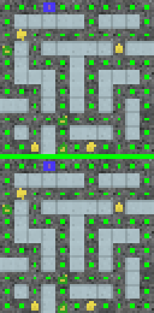
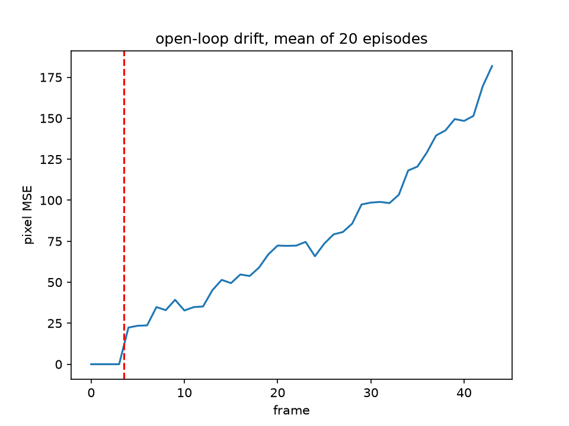
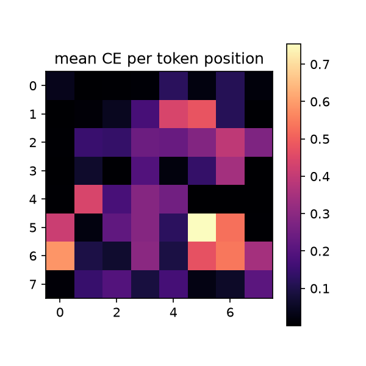

# nano-world-model

**A world model you can read in an afternoon and play inside.** ~950 lines of
PyTorch (plus a verbatim, unmodified copy of nanoGPT) train two small networks
on offline gameplay from procgen **Chaser**, then hallucinate the game live
from your keyboard — no game engine, every frame sampled from a GPT.



In the spirit of [nanoGPT](https://github.com/karpathy/nanoGPT): minimal code,
no framework machinery, every important idea visible in the source. If you can
read nanoGPT, you already know 80% of this repo — the last 20% is the point.

## What is a world model?

A world model is a learned simulator: given what has happened so far and an
action, predict what the world looks like next. It's the difference between an
agent that must act in the real environment to learn and one that can
*imagine* — plan, practice, and train policies inside its own prediction of
the world (Ha & Schmidhuber 2018; Dreamer; IRIS; Genie; GameNGen). The core
capability is **action-conditioned prediction**: the model must answer "what
happens if *I do this*?", not just "what usually happens next?".

This repo builds the smallest version of that idea that still exhibits the
real phenomena — coherent long rollouts, controllable dynamics, compounding
error — on a game simple enough that you can *see* the model think.

## The idea in one diagram

```
                        train once, offline
  64×64 frame ──► VQ-VAE encoder ──► 8×8 grid of tokens (64 ints from a 512-word codebook)

  GPT (nanoGPT, 14M params) reads:   z0¹…z0⁶⁴  a0  z1¹…z1⁶⁴  a1  …
  and is trained with plain next-token cross-entropy.

                        play, forever
  your action ──► append token 512+a ──► sample 64 tokens ──► VQ-VAE decoder ──► next frame
```

Two models, one trick each:

- **`VQVAE`** (`model.py`) — conv encoder/decoder with a vector-quantized
  bottleneck: each frame becomes 64 discrete tokens. The frame is now
  *language-shaped*.
- **`WorldModel`** (`model.py`) — **verbatim nanoGPT**. Not "inspired by":
  `nanogpt.py` in this repo is Karpathy's `model.py`, vendored unchanged and
  pinned to an upstream commit — diff it yourself. Its "text" interleaves
  frame tokens with **action tokens** (one shared 527-word vocab: 512 frame
  codes + 15 procgen actions). Each action token sits *between the frame where
  it was pressed and the frame it causes*, so sampling the next frame is:
  append action, sample 64 tokens. The loss is masked so the model never
  predicts action tokens — and even that masking flows through nanoGPT's own
  `cross_entropy(..., ignore_index=-1)`, untouched.

### What exactly is nanoGPT here, and what isn't?

```
nanogpt.py   Karpathy's model.py, verbatim (MIT), pinned @ f08abb4.
             Verify:  curl -s https://raw.githubusercontent.com/karpathy/nanoGPT/f08abb45bd2285627d17da16daea14dda7e7253e/model.py | diff - <(tail -n +11 nanogpt.py)
model.py     everything world-model-specific:
             - the VQ-VAE tokenizer
             - WorldModel: a GPT + generate_frame() (nanoGPT's generate(),
               restricted to the frame vocabulary)
             - KVSampler: OPTIONAL speed path for real-time play
```

The training loop optimizes an unmodified nanoGPT; the entire "world model"
lives in the config values and in what the tokens *mean*.

**Sidebar — why is `KVSampler` separate?** nanoGPT's attention is stateless
(`forward(x)` in, `y` out), so generating a frame costs 64 *full* forward
passes. A KV cache needs two things that API doesn't offer: a way to pass
cached keys/values in and get new ones out — and once queries and keys have
different lengths, `is_causal=True` becomes silently wrong (the mask must be
offset by the cache length). Rather than subclass nanoGPT and override every
`forward`, `KVSampler` drives the *same vendored modules* (`c_attn`, `c_proj`,
`mlp`, the LayerNorms — same weights, same math) in a cached loop. Two tests
pin the claim: cached logits equal the full forward's, and with the same seed
the fast and slow paths sample *identical* frames. Skip it on first read;
`WorldModel.generate_frame` is the concept, ~10× slower.

## Quickstart

```bash
git clone https://github.com/krohling/nanoGPT-WM.git
cd nanoGPT-WM
pip install -r requirements.txt

# fast path: pretrained checkpoints + held-out episodes (~100 MB total)
python -c "import data; data.download(episodes_only=True)"
python -c "from huggingface_hub import hf_hub_download as d; \
  [print(d('kevin510/nano-world-model', f)) for f in ('tokenizer.pt','world_model.pt')]"

# play inside the dream (arrows move, R re-primes, -/+ temperature, ESC quits)
python play.py --tokenizer <tokenizer.pt path> --wm <world_model.pt path> --data data/chaser
```

Or open **`walkthrough.ipynb`** in Colab — it downloads everything and
includes a button-driven version of the play demo.

## Train it yourself

```bash
python -c "import data; data.download()"        # full dataset, ~5.4 GB
python train_tokenizer.py --data data/chaser --out out/tok8 --steps 30000 --bs 128
python train_wm.py --data data/chaser --tokenizer out/tok8/tokenizer.pt --out out/wm --prepare
python train_wm.py --data data/chaser --tokenizer out/tok8/tokenizer.pt --out out/wm --steps 40000 --bs 16
```

Measured on one A100: tokenizer ~11 min, world model ~25 min. Budget a Colab
T4 at roughly 4× that. Both scripts take `--overfit` for a single-batch sanity
check, and `--device cpu` runs a tiny config in minutes for debugging.

The data is a curated slice of Meta's
[gen_dgrl](https://github.com/facebookresearch/gen_dgrl) offline procgen
release (PPO agents, expert + suboptimal mixed 50/50 for state–action
coverage), re-hosted as flat memmap-able uint8 binaries — see
`scripts/curate_dataset.py` for the exact provenance pipeline.

## FAQ: the four questions everyone asks

**1. Why discrete tokens at all? Why not regress the next frame?**
Under an L2 loss, the optimal prediction is the *mean over possible futures*.
When an enemy can turn left or right, the mean is two half-transparent
enemies — the blurry smear that plagued 2016-era video prediction. A
categorical softmax can hold both futures *sharply* and sampling **commits**
to one. Discretization exists to buy that softmax (and with it the whole LLM
toolkit: cross-entropy, temperature, top-k). The continuous-space fixes are
mixture heads (Ha & Schmidhuber's MDN) or diffusion (DIAMOND, GameNGen);
tokens are the choice that turns the problem into nanoGPT.

**2. Why sample instead of taking the argmax?**
Same reason: the future is genuinely uncertain, and per-position argmax is a
committee with no chairman — each token independently picks its most likely
value and the combination can be globally incoherent. Sampling with the chain
rule picks *one* coherent future. (Try `--temperature 0.1` in `play.py` — near-
argmax works in Chaser precisely to the degree the game is deterministic.)

**3. Why autoregressive over the 64 tokens of a frame? Why not one shot?**
A one-shot multi-head output samples the *product of marginals*, not the
joint. Attention — masked or not — lets positions share **beliefs** (their
logits see the same inputs), but never sampled **outcomes**: all 64
distributions are computed before any die is cast, so the enemy at the
junction goes half-left, half-right. Dependence between outputs requires
realized samples to re-enter the computation. AR does it one token at a time
(exact, 64 steps); MaskGIT-style iterative decoding does it in ~8 rounds
(Genie's choice); a shared latent variable does it in one (CVAE). We use full
AR because it keeps `generate_frame()` line-for-line nanoGPT — and 64 cached
steps per frame is fast at this scale.

**4. Why 64 tokens per frame instead of one big token?**
One token per frame means a codebook with an entry per *distinguishable game
state* — procgen's mazes are combinatorial, so no. There's a conservation law:
you pay either sequence length (more AR steps) or vocabulary size
(exponentially larger softmax). 64 tokens × 512 codes expresses 512⁶⁴ frames
with only 64×512 learned quantities, exploiting the fact that images are
compositional — the same reason LLMs use ~50k word pieces rather than a
vocabulary of sentences.

*(Bonus: "isn't appending an action token just concatenating an action
embedding?" — Yes, in the sequence dimension. The alternative meaning —
concatenating the action embedding onto every frame token's features, as in
Dreamer/DIAMOND — modifies the architecture. In-band action tokens leave the
GPT untouched: actions are just words.)*

## What to look at after training

| artifact | what it teaches |
|---|---|
| `eval.py rollout` — real-vs-dream GIFs | open-loop coherence and where dreams diverge |
| `eval.py drift`  | compounding error: smooth, near-linear growth — the fundamental cost of open-loop generation |
| `eval.py loss-heatmap`  | **the money plot**: per-token-position cross-entropy. Most of the maze costs ≈0 ("copy the previous frame"); the hard tokens are exactly where the agent and enemies move. Dynamics, made visible. |
| tokenizer panels (`scripts/make_tokenizer_panels.py`) | codebook health, worst-case reconstructions, where the tokenizer spends its budget |

Run 1 numbers for reference: tokenizer val MSE 3.4e-4 with 511/512 codes in
use; world model val CE 0.177 (frame tokens only); dreamed agent obeys held
LEFT/RIGHT within ±10–30 px over 10 steps in every test maze.

## Limitations & where to go next

- **Compounding error is real**: past ~40 open-loop steps sprite positions
  drift from any real trajectory (the maze itself stays solid). That's the
  honest baseline all world-model research fights.
- **Latent actions (IDM/LAM)** — learn the action space *unsupervised* from
  video, Genie-style, then swap labeled actions for latent ones. Same GPT.
- **MaskGIT decoding** — replace 64 AR steps with ~8 parallel refinement
  rounds; the bridge from IRIS to Genie.
- **Diffusion head** — the continuous-space answer to question 1
  (DIAMOND/GameNGen lineage).
- **Your own data** — `scripts/` shows the full curation pipeline; comparing
  PPO-checkpoint-mixture data against gen_dgrl's is an open, publishable-shaped
  question about coverage.

## Acknowledgments

`nanogpt.py` is vendored verbatim from
[nanoGPT](https://github.com/karpathy/nanoGPT) © Andrej Karpathy, MIT license.
Data: [gen_dgrl](https://github.com/facebookresearch/gen_dgrl) (Mediratta et
al., ICLR 2024), CC-BY-NC 4.0 — this repo's dataset re-host is likewise
non-commercial. Architecture lineage: VQ-VAE (van den Oord et al. 2017), IRIS
(Micheli et al. 2023). Environment: procgen (Cobbe et al. 2020). Code: MIT.
